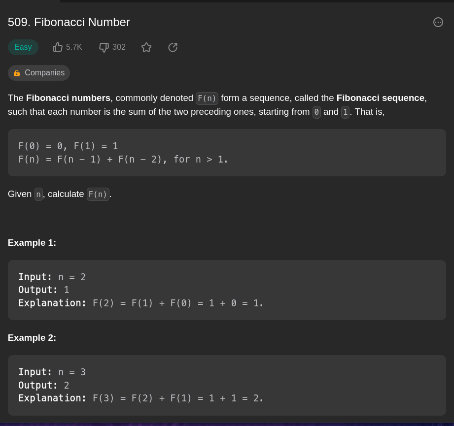

# Fibonacci Number - Recursion (easy)

- *Time*: 28 min 9 sec
- *Video*: https://youtu.be/qbsuUxKNQs8



## Notes


### What do we know?

- Something to do with recursion
- F(0) == 0 so we don't really need to include it

#### What is fibonacci numbers?
- commonly known as F(n)
- a sequence where each number is the sum of the two preceding ones
- this sequence starts from 0 and 1, where F(0) == 0 and F(1) == 1


```
Example:

F(0) == 0
F(1) == 1
F(2) == F(0) + F(1) == 1
F(3) == F(1) + F(2) == 2
F(4) == F(2) + F(3) = 3


F(4) == F(3) + F(2) + F(1)

F(n) == F(n - 1) + F(n - 2) + F(n - 3)
```

How do we know the function is stopped?
- is n == 0


We need a fib total.
Continously feed -1 into the function argument
Increase the total each time recursively 

Figure out the function

```python3
total = 0
4 == 0? False

total = 5  + 2

3 == 0? False
total = 3 + 2

2 == 0? False 
total = 1 + 1

1 == 0? False
total = 1 + 1

2 == 0? False
total = 3

1 == 0? False 
total = 1 + 1


0 == 0? True
return 1
```


