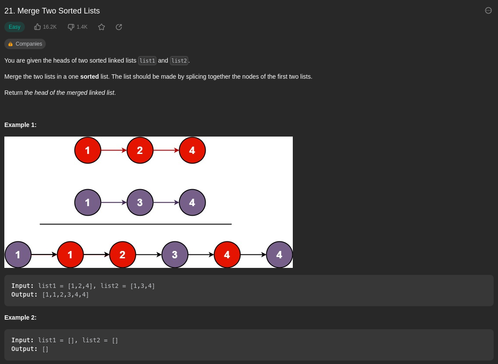

# Merge Two Sorted Lists

*Video*:

What we know:

- Recursion question
- singly list linked question

What to do:

- We need to traverse each linked list and figure out
    the smallest value

- after finding the smallest value, compare them with
    each other. The smaller value makes a new linked list

From Video:

- We want to traverse the list and compare each.
- If we reach the end of a list node, we can append the rest
    of the other list since its arleady sorted
