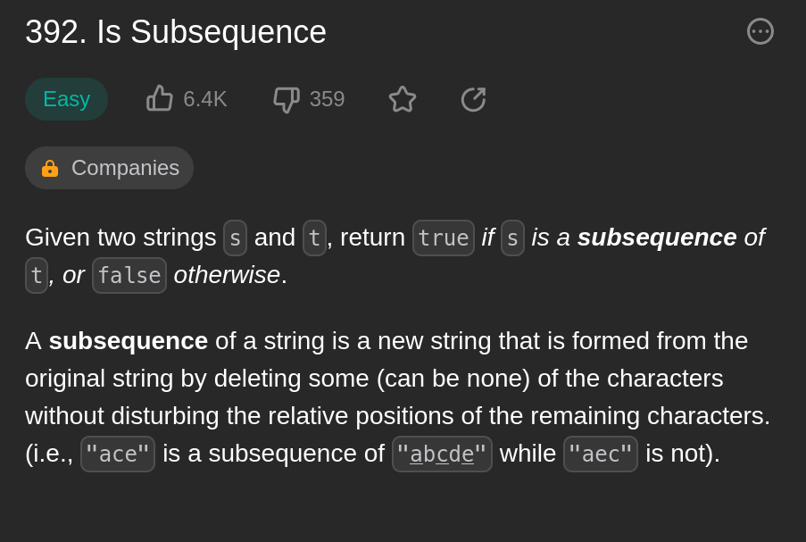

# 392. Is Subsequence

*Video*: https://youtu.be/YajDstn_JNc



What do we know?
1. we are giving two strings, s and t
2. find out if s is a substring of t
3. a substring has all the characters of it's parent in the same relative order


What do we have to do?
1. Make sure all the characters in "s" belong in "t"
2. Make sure that the relative order is the same as well


Store the characters in a string with their index 

Plan 1:
1. Loop through "t" and continue to pop/shift out element until all characters of 
    "s" is found.


# Intuition
<!-- Describe your first thoughts on how to solve this problem. -->
My first thoughts on this would be that I would have to store both into a dictionary and check to see if both had the same amount of characters. After that, I would compare the indexes with each other to check for relative position. However, I find a better solution using the `.pop()` method and lists!

# Approach
<!-- Describe your approach to solving the problem. -->
First, we split the substring into a list. After that, we can loop through the alpha-string and see if the any letter matches the 0-indexed element in the substring. If it does, we can `.pop()` it out. Once we pop it out, the 0-indexed element changes so we can check that! This also helps us with relative position because the pop() method removes it in order! If an element shows up too soon or too late, (not in order), then the substring won't be fully empty at the end!

At the end, if the substring list is empty, then we can return True

# Code
```python
class Solution:
    def isSubsequence(self, s: str, t: str) -> bool:
        substring = [letter for letter in s]
        for letter in t:
            if substring:
                need_to_find = substring[0]
                if need_to_find == letter:
                    substring.pop(0)

        return not substring
```
