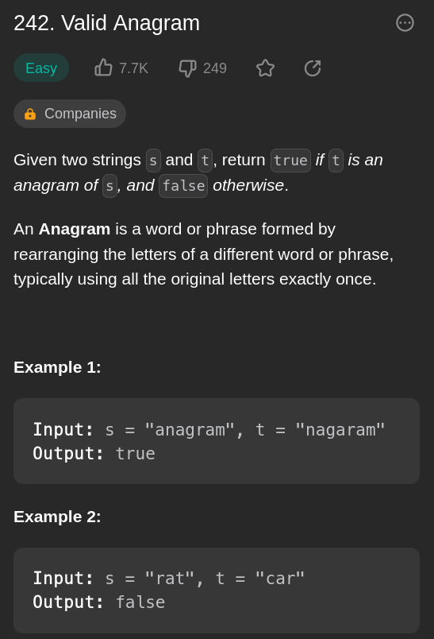

# 242. Valid Anagram
*Video*: https://youtu.be/xbx5f8ytLtk

What do we know?
1. Return true if all the letters in string one appear in string two exactly and online once

What should we do?

1. Store the values inside a dictionary.
2. Increment the value each if duplicate occurs
3. Compare both dictionary to see if they are the same!
4. If they are the same then return true
5. Otherwise, false
