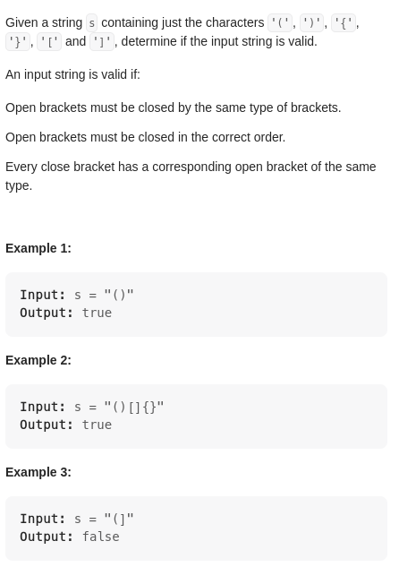

# Valid Parentheses

*Time*: 1+ hour -- looked at solution
*Video*: https://youtu.be/H7WBVBvM8e4

## Run Down

We are given a string with only brackets.
The input is valid if the bracket closes itself with the same bracket.
If they don't close itself with the same bracket, then it is false.

### Plan

1. Make tuples of each bracket
2. loop through the string to check odd-indexed characters. 
    Check their even indexed counterpart if they are within tuple

**Test Case**
"{[]}" == True
"{[}]" == False 
"{[{}]}" == True

Opened brackets mustbe closed in the correct order:
    - therefore it is impossible for brackets next to each other to close with
        a different bracket
    - eg: "{[}]"
    - 
